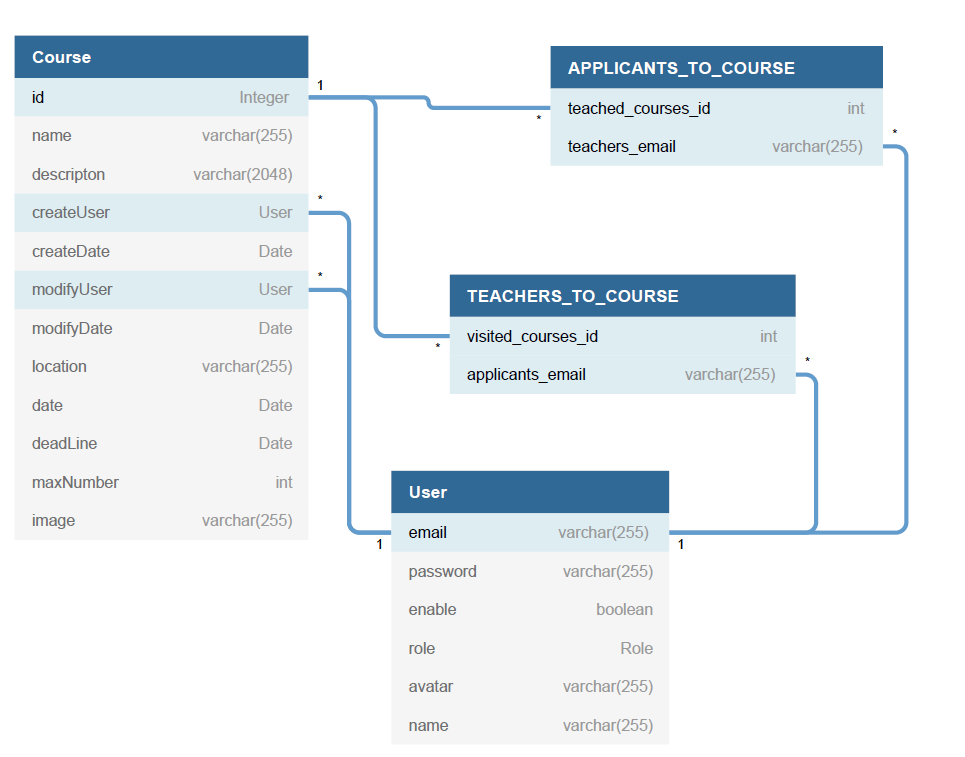

# ODA 
Alkalmazásunk egy tánciskola kurzusaira történő jelentkezést teszi áttekinthetőbbé, az oktatók az iskola és a táncosok számára.
* Funkcionális követelmények:
	* sima felhasználó:
		* kurzus megtekintés
		* kurzusra jelentkezés
		* keresni tud kurzusok között
		* rendezni tudja a kurzusokat
		* megtekintheti az összes felhasználót
	* oktató:
		* kurzust tud létrehozni
		* saját kurzusát tudja módosítani
		* saját kurzusát tudja törölni
	* admin:
		* oktatatói jogosultságot tud módosítani
		* bármelyik kurzust törölheti vagy szerkesztheti
* Nem funkcionális követelmények:
	* hatékonyság
	* karbantarthatóság
	* fejleszthegőség
	* hibatűrés
* Szerepkörök:
	* sima felhasználó: Csupán egy résztvevője a kurzusoknak
	* oktató: Kurzust tartja, kurzusokat indít, módosít
	* admin: karbantartja a felületet, oktatói jogosultságot ad/elvesz,
	 továbba mindenhez joga van amihez egy oktatónak illetve sima felhasználónak
* Szakterületi fogalomjegyzék:
	* tánc: egy művészeti ág, amelyet a test jellemzően ritmikus zenére történő mozgásával fejez ki érzelmeket, épít társadalmi kapcsolatokat, de spirituális tartalommal is bírhat. 
	* kurzus: az a keret amelyben a hallgatók meghatározott rend szerint gyarapítják tudásukat és arról számot is adnak.
	* jelentkezés: felhasználó kurzuson történő részvételi szándékának kifejezése
	* módosítás: Egy adott kurzus adatainak megváltoztatása pl.: helyszín, időpont...
	* hozzáadás: Új kurzus létrehozása
	

