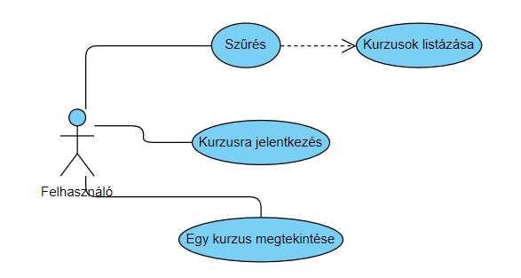
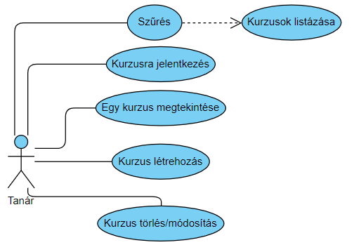
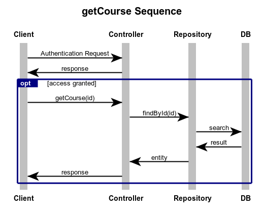

# ODA 
Alkalmazásunk egy tánciskola kurzusaira történő jelentkezést teszi áttekinthetőbbé, az oktatók az iskola és a táncosok számára.
* Funkcionális követelmények:
	* sima felhasználó:
		* kurzus megtekintés
		* kurzusra jelentkezés
		* keresni tud kurzusok között
		* rendezni tudja a kurzusokat
		* megtekintheti az összes felhasználót
	* oktató:
		* kurzust tud létrehozni
		* saját kurzusát tudja módosítani
		* saját kurzusát tudja törölni
	* admin:
		* oktatatói jogosultságot tud módosítani
		* bármelyik kurzust törölheti vagy szerkesztheti
* Nem funkcionális követelmények:
	* hatékonyság
	* karbantarthatóság
	* fejleszthegőség
	* hibatűrés
* Szerepkörök:
	* sima felhasználó: Csupán egy résztvevője a kurzusoknak
	* oktató: Kurzust tartja, kurzusokat indít, módosít
	* admin: karbantartja a felületet, oktatói jogosultságot ad/elvesz,
	 továbba mindenhez joga van amihez egy oktatónak illetve sima felhasználónak
* Szakterületi fogalomjegyzék:
	* tánc: egy művészeti ág, amelyet a test jellemzően ritmikus zenére történő mozgásával fejez ki érzelmeket, épít társadalmi kapcsolatokat, de spirituális tartalommal is bírhat. 
	* kurzus: az a keret amelyben a hallgatók meghatározott rend szerint gyarapítják tudásukat és arról számot is adnak.
	* jelentkezés: felhasználó kurzuson történő részvételi szándékának kifejezése
	* módosítás: Egy adott kurzus adatainak megváltoztatása pl.: helyszín, időpont...
	* hozzáadás: Új kurzus létrehozása
* Használt technológiák:
	* Java Spring Boot technológia 
	* MVC modell
	* REST API
	* H2
	* lombok
	* apache commons
* Végpontok:
	* GET/course/get/:id: egy kurzus lekérése
	* GET/course/mainpage: Főoldal lekérése
	* POST/course/add: Kurzus hozzáadása
	* PUT/course/modify/:id: kurzus módosítása
	* DELETE/course/delete: kurzus törlése
	* PATCH/course/apply: jelentkezés kurzusra
	* POST/course/image: kurzus borítóképének kezelése
	* POST/users/register: regisztrációs adatok elküldése
	* POST/users/login: belepési adatok elküldése
	* GET/users/users: felhasználók lekérése
	* PATCH/users/set: felhasználó szerepkörének módosítása
	* POST/users/avatar: avatar feltöltés
* Könyvtárstruktúra:
	* controllers:
		* CourseController
		* UserController
	* entities:
		* Course
		* User
	* repositories:
		* CourseRepository
		* UserRepository
	* services:
		* ImageService
* Fejlesztőkörnyezet:
Lokális IDE: Visual Studio Code 2017, NetBeans IDE 8.2
	* Github account nem szükséges, de hasznos
	* Hozzunk létre egy munkakönyvtárat
	* node.js-el töltsük le az adonisJS-t
	* adonissJS hozzuk létre a fejlesztő környezetet
	* Ezen a munkaterületen elkezdhetünk kódolni
	* Miután végeztünk a munkával elmenthetjük lokálisan vagy github-ra
	* Githubra először a Visual Studio-n belül a Stage All-al kijelöljük a pusholni kívánt fájlokat majd commit-áljuk őket. Ezután a Push paranccsal föltölthetjük a github accountunkra

* Használati eset diagramm felhasználó:
	* 
* Használati eset diagramm tanár:
	* 
* Szekvencia diagramm:
	* 
* Adatbázis terv:	
	
